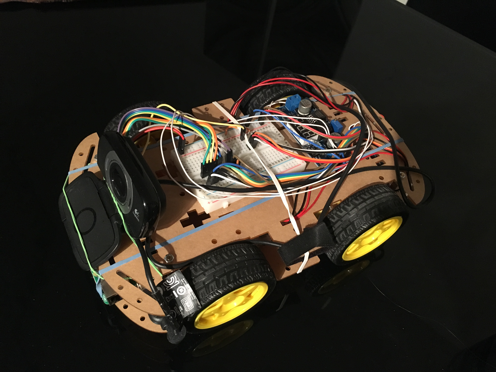

# raspi-car

A remote controlled car powered by the raspberry pi.

## Hardware
- Car Chassis 4WD (including 4 DC motors)
- L293D Motor Drive Shield
- Raspberry Pi 3
- 16 GB SD Card
- Anker PowerCore 13000mAh
- 400 Pin Breadboard
- Logitech Webcam (optional)
- LM2577 DC converter (optional)

## Configuration

- The python based backend runs a REST service which exposes movement functionality
- The Angular based frontend allows to control the car and displays a streaming video from the front camera

## Installation

Install debian dependencies

    sudo apt-get install git supervisor python3 python3-pip nginx libjpeg-dev

Install python dependencies

    sudo pip3 install gunicorn falcon wiringpi

To use wiringpi on kernel 4.9 one needs to apply a patch - see [here](https://github.com/WiringPi/WiringPi-Python/issues/47)

Install npm dependencies

    curl -sL https://deb.nodesource.com/setup_6.x | sudo bash -
    sudo apt-get install nodejs
    npm install bower -g
    
    cd web
    bower install ngtouch --save

Create symlinks

    $PR = /home/pi/raspi-car
    ln -sf $PR/conf/nginx/default /etc/nginx/sites-enabled/default
    ln -s $PR/conf/supervisor/carweb.conf /etc/supervisor/conf.d/carweb.conf
    ln -s $PR/conf/supervisor/livestream.conf /etc/supervisor/conf.d/livestream.conf